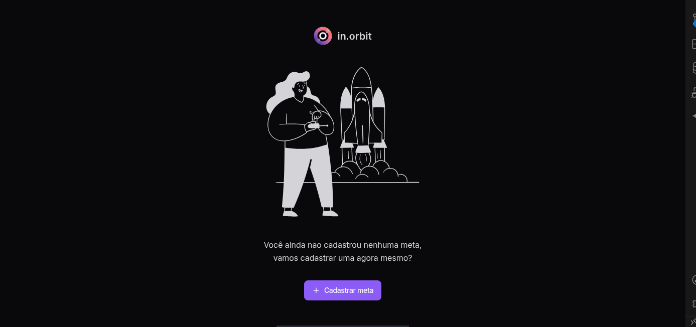
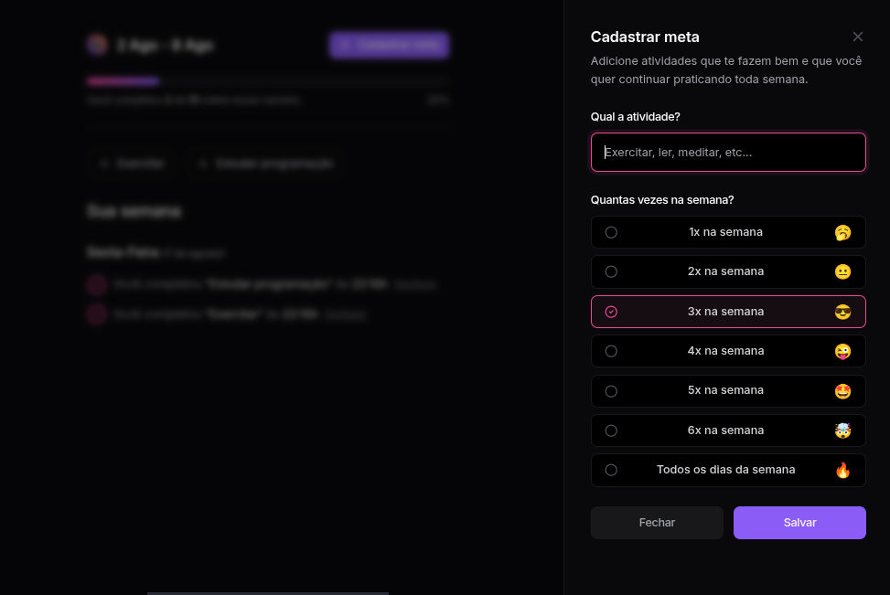
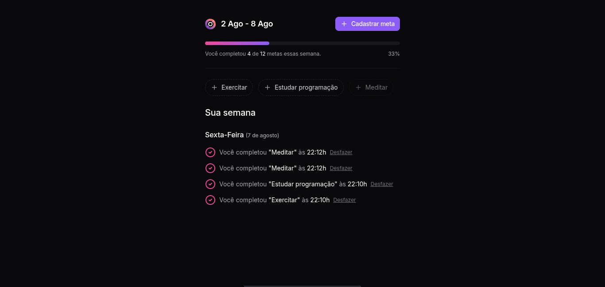

<p align="center">
  
</p>

<h1 align="center">in.orbit</h1>

<p align="center">
  Acompanhe e conquiste suas metas semanais com consistência.
</p>

<p align="center">
  
  
  
  
  
</p>

---

## 📌 Sobre o projeto

O **in.orbit** é uma aplicação web de **gerenciamento de metas semanais** focada em consistência e progresso pessoal. A ideia é simples: cadastre hábitos e atividades que você quer praticar durante a semana — como exercitar, ler ou meditar — e marque cada vez que os completa.

Ao final da semana você tem um panorama claro de quanto evoluiu, com histórico por dia e horário de cada conquista.

---

## 🖥️ Telas

<p align="center">
  <strong>Tela Inicial</strong><br/>
  
</p>

<p align="center">
  <strong>Cadastrar Meta</strong><br/>
  
</p>

<p align="center">
  <strong>Progresso Semanal</strong><br/>
  
</p>

---

## ✨ Funcionalidades

- ✅ **Cadastro de metas** — defina o nome da atividade e a frequência desejada (de 1x até todos os dias da semana)
- ✅ **Conclusão de metas** — marque metas como concluídas com um clique
- ✅ **Progresso semanal** — barra de progresso com percentual de conclusão em tempo real
- ✅ **Histórico por dia** — veja quais atividades foram concluídas, em qual dia e horário
- ✅ **Desfazer conclusão** — reverteu por engano? Desfaça com um clique
- ✅ **Interface responsiva** — layout limpo e adaptado para diferentes tamanhos de tela

---

## 🛠️ Tecnologias

| Tecnologia | Descrição |
|---|---|
| [React 18](https://react.dev/) | Biblioteca para construção de interfaces |
| [TypeScript](https://www.typescriptlang.org/) | Superset tipado do JavaScript |
| [Vite](https://vitejs.dev/) | Build tool e dev server ultrarrápido |
| [Tailwind CSS](https://tailwindcss.com/) | Framework de estilização utilitária |
| [Radix UI](https://www.radix-ui.com/) | Componentes acessíveis (Dialog, Progress, RadioGroup) |
| [TanStack Query](https://tanstack.com/query) | Gerenciamento de estado e cache de requisições |
| [React Hook Form](https://react-hook-form.com/) | Gerenciamento de formulários performático |
| [Zod](https://zod.dev/) | Validação de esquemas com TypeScript |
| [Day.js](https://day.js.org/) | Manipulação e formatação de datas (pt-BR) |
| [Lucide React](https://lucide.dev/) | Biblioteca de ícones |

---

## 🚀 Como rodar localmente

### Pré-requisitos

- [Node.js](https://nodejs.org/) 18+
- [npm](https://www.npmjs.com/) ou [pnpm](https://pnpm.io/)
- Backend da aplicação rodando ([repositório do backend](https://github.com/emerss001/backend-inOrbit))

### Instalação

```bash
# Clone o repositório
git clone https://github.com/seu-usuario/in-orbit.git

# Entre na pasta do projeto
cd in-orbit

# Instale as dependências
npm install
```

### Configuração de ambiente

O projeto consome uma API REST. Certifique-se de que o backend está rodando e aponte a URL no arquivo:

```
src/http/urlBase.ts
```

```ts
const urlBase = "http://localhost:4545";
```

### Rodando o projeto

```bash
npm run dev
```

Acesse [http://localhost:5173](http://localhost:5173) no seu navegador.

---

## 📁 Estrutura de pastas

```
in-orbit/
├── .github/
│   └── prints/          # Screenshots do projeto
├── public/              # Arquivos estáticos públicos
└── src/
    ├── assets/          # Imagens e SVGs
    ├── components/
    │   ├── ui/          # Componentes base reutilizáveis
    │   ├── create-goal.tsx      # Modal de criação de meta
    │   ├── empty-goals.tsx      # Tela de estado vazio
    │   ├── pending-goals.tsx    # Lista de metas pendentes
    │   └── summary.tsx          # Dashboard semanal
    ├── http/            # Camada de comunicação com a API
    │   ├── create-goal.ts
    │   ├── create-goal-completion.ts
    │   ├── get-pending-goals.ts
    │   ├── get-summary.ts
    │   ├── undo-goal-completion.ts
    │   └── urlBase.ts
    ├── App.tsx
    └── main.tsx
```

---

## 📄 Licença

Este projeto está sob a licença **MIT**. Veja o arquivo [LICENSE](./LICENSE) para mais detalhes.

